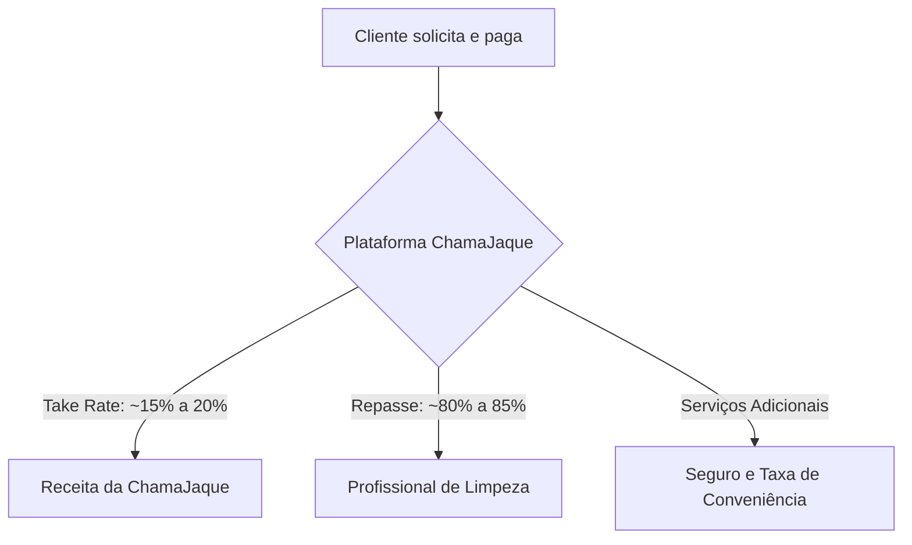

# ChamaJaque - Pitch Deck & Modelo de Negócios

Este documento apresenta uma visão estratégica, comercial e técnica da plataforma **ChamaJaque** para apresentação a futuros investidores.

---

## 1. Sumário Executivo

A **ChamaJaque** é uma plataforma digital (marketplace mobile-first) que conecta profissionais de limpeza doméstica (diaristas) a contratantes, com foco em **transparência, segurança e valorização do trabalho doméstico**. Diferente dos marketplaces tradicionais que competem puramente por preço baixo, a ChamaJaque baseia-se em um algoritmo de preço justo baseado em esforço real, promovendo um ecossistema sustentável, honesto e ético.

---

## 2. O Problema

O mercado de serviços domésticos no Brasil movimenta bilhões de reais anualmente, mas enfrenta graves dores estruturais:

* **Informalidade e Insegurança:** Falta de checagem de antecedentes e verificação de perfil de ambas as partes, gerando desconfiança mútua.
* **Exploração e Preços Arbitrários:** Profissionais frequentemente submetidas a cargas de trabalho exaustivas com remuneração inadequada, ou clientes pagando taxas abusivas para agências intermediárias.
* **Ineficiência no Match:** Processo lento de contratação baseado em indicações informais no WhatsApp, sem garantias de comparecimento ou qualidade.
* **Falta de Transparência:** Ausência de critérios claros sobre o que compõe o preço de uma faxina (tamanho do imóvel, tarefas extras, nível de sujidade).

---

## 3. A Solução (ChamaJaque)

Um ecossistema digital inteligente, humanizado e focado em dispositivos móveis:

* **Algoritmo de Preço Justo:** Cálculo automatizado baseado em esforço real (número de quartos, banheiros, nível de detalhamento e opcionais contratados como passar roupa ou limpar janelas).
* **DNA de Respeito e Valorização:** A plataforma atrai e retém as melhores profissionais por garantir remuneração digna, criando uma reputação forte e orgânica no mercado.
* **Match Inteligente e Ágil:** Algoritmo que conecta o cliente à profissional ideal disponível geograficamente mais próxima, reduzindo custos de transporte e otimizando o tempo.
* **Segurança e Trust & Safety:** Verificação de perfis integrada (Supabase Security, conformidade com a LGPD e auditoria de segurança integrada).
* **Pagamento Seguro Simplificado:** Checkout digital integrado com gateways modernos (como Mercado Pago), garantindo o repasse ágil e seguro das diárias.

---

## 4. O Produto (Visão de Tecnologia)

A plataforma foi desenvolvida utilizando tecnologias modernas e escaláveis para garantir altíssima performance com baixo custo operacional:

* **Frontend:** Next.js (com React, Tailwind CSS e Shadcn UI) construído sob o conceito **Mobile-First** para atender à realidade de acessibilidade das profissionais e comodidade dos clientes.
* **Backend e Segurança:** Supabase (PostgreSQL) com políticas rígidas de segurança em nível de linha (RLS), garantindo privacidade e controle total de dados sensíveis.
* **Arquitetura Escalável:** Pronta para receber picos de requisições de forma distribuída (Serverless e Edge Functions).

---

## 5. Modelo de Negócios (Business Model)

A ChamaJaque atua sob o modelo de **Take Rate (Comissão por Transação)** com alavancas extras de monetização:

### Fontes de Receita:
1. **Comissão Base (Take Rate):** Uma taxa de conveniência sobre cada faxina contratada pela plataforma, embutida no preço final.
2. **Taxas de Conveniência Corporativa (B2B):** Pacotes de limpeza recorrente para escritórios e consultórios (com margens mais elevadas).
3. **Serviços Financeiros & Micro-seguros:** Futura oferta de micro-seguros contra acidentes de trabalho para as diaristas parceiras (segurança estendida) e seguro de danos residenciais para os clientes.

---

## 6. O Mercado e Oportunidade

* **Tamanho do Mercado (TAM):** O Brasil possui uma das maiores populações de trabalhadores domésticos do mundo, com mais de 6 milhões de profissionais atuando no setor.
* **Mercado Endereçável Útil (SAM):** Lares de classe média e alta em capitais e regiões metropolitanas que utilizam serviços de limpeza ao menos duas vezes por mês.
* **Tendência de Digitalização:** A transição de serviços do offline (WhatsApp/indicações) para plataformas de conveniência cresce de forma exponencial pós-pandemia.

---

## 7. Diferenciais Competitivos

| Característica | Concorrentes Tradicionais | ChamaJaque |
| :--- | :--- | :--- |
| **Foco de Preço** | Leilão de preço mais baixo | **Preço justo por esforço real** |
| **Rotatividade (Churn)** | Alta rotatividade de profissionais | **Alta retenção (parceiras valorizadas)** |
| **Segurança** | Verificação básica | **Módulo de Trust & Safety integrado** |
| **Usabilidade** | Interfaces genéricas/pesadas | **Layout mobile-first simplificado** |

---

## 8. Roadmap de Crescimento (Tração futura)

* **Fase 1 (MVP Validado):** Lançamento regional, captação das primeiras 100 profissionais parceiras e testes de match geolocalizado.
* **Fase 2 (Escala e Branding):** Expansão para grandes capitais (SP, RJ, BH) e ativação de marketing orgânico via comunidade e indicações (K-factor).
* **Fase 3 (Ecossistema Financeiro):** Criação da "Conta Digital da Jaque" – serviços financeiros desenhados exclusivamente para a emancipação e estabilidade das profissionais domésticas.

---

## 9. O que buscamos (A Oportunidade para o Investidor)

Buscamos parceiros estratégicos (Smart Money) dispostos a acelerar a aquisição de clientes, expansão de equipe de engenharia e marketing regional para consolidar a ChamaJaque como a plataforma número um em serviços domésticos humanizados do Brasil.
