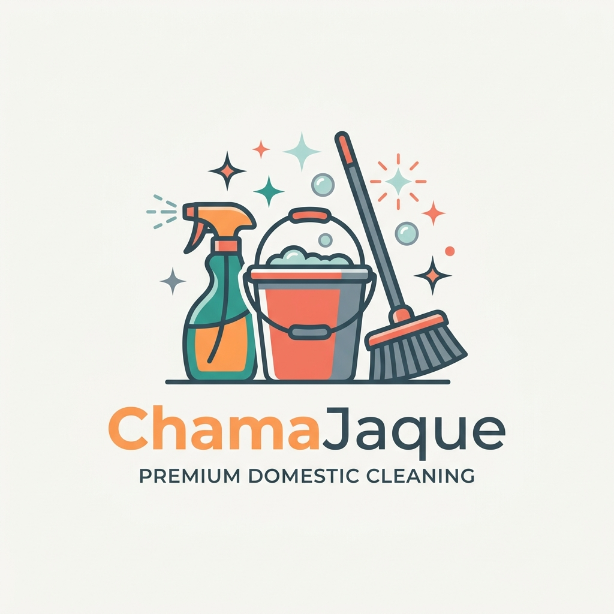

# ChamaJaque - Apresentação para o LinkedIn 🚀

Este documento contém o conteúdo pronto e estruturado para você publicar no seu perfil do LinkedIn ou criar um artigo, engajando sua rede profissional com a história, curiosidades e o impacto da **ChamaJaque**.

---

## 📝 Opção de Post (Pronto para copiar e colar)

### 📌 O título / Gancho:
**Você sabia que o Brasil tem uma das maiores populações de trabalhadores domésticos do mundo, mas cerca de 70% ainda atua na informalidade?**

---

### 💬 Corpo do Texto:

Mais do que conectar contratantes a profissionais de limpeza, a nossa missão na **ChamaJaque** é transformar a realidade da Economia do Cuidado (*Care Economy*) através da tecnologia e da valorização humana.

Nós acreditamos que um lar limpo começa com o respeito a quem cuida dele. Por isso, desenvolvemos uma plataforma mobile-first focada em dignidade, segurança e um algoritmo que calcula o preço justo baseado no esforço real, e não no tamanho arbitrário do imóvel.

Abaixo, compartilho **3 curiosidades sobre os bastidores da ChamaJaque** e o setor que estamos inovando:

---

### 💡 3 Curiosidades e Fatos do Mercado

#### 1. De onde vem o nome "Jaque"? 🧐
Quem nunca usou a expressão popular *"já que"*? *"Já que você vai na cozinha, traz um copo d'água"* ou *"já que você vai limpar..."*. Nós ressignificamos essa expressão! A **ChamaJaque** transforma o *"já que"* em uma solução rápida, profissional e de confiança. Quando bater a necessidade: chama quem resolve com excelência, **Chama a Jaque**!

#### 2. Esforço Real vs Metros Quadrados ⚖️
A maioria das plataformas tradicionais cobra diárias calculando estritamente o tamanho do imóvel ($m^2$). Isso é injusto! Uma casa pequena com pets e pós-festa exige muito mais trabalho do que um apartamento grande e minimalista. Nosso algoritmo calcula o preço baseado no **número de cômodos, nível de sujidade e tarefas adicionais**, garantindo que a profissional seja remunerada de forma justa pelo trabalho real entregue.

#### 3. O impacto invisível da Economia do Cuidado (*Care Economy*) 🌍
Estudos globais mostram que se o trabalho doméstico e de cuidado não remunerado ou subvalorizado fosse contabilizado no PIB mundial, ele representaria cerca de **11 trilhões de dólares anualmente**. Valorizar essas profissionais é impulsionar a base da pirâmide econômica e gerar impacto social direto na vida de milhares de famílias.

---

### 📸 Imagem da Marca para o Post

Aqui está a nossa nova identidade visual oficial (Opção 3), focada nos produtos de limpeza em primeiro plano, com a vassoura e o brilho do serviço doméstico honrado:

---

### 🎯 Nosso Convite:
Se você é profissional da área ou quer contratar uma faxina justa e segura para o seu lar, acesse o nosso aplicativo! 
Se você é investidor e quer fazer parte dessa revolução na Economia do Cuidado, vamos conversar! 💬

**#ChamaJaque #CareEconomy #ImpactoSocial #TechForGood #Startup #Empreendedorismo #DignidadeGeraDignidade**

---

## 🛠️ Dicas extras para a postagem:
1. **Marque a imagem:** Ao postar no LinkedIn, suba o arquivo [logo.png](file:///c:/Users/alber/Desktop/chamajacke/public/logo.png) (salvo em sua pasta pública) como o arquivo de imagem do post para atrair mais engajamento visual.
2. **Engajamento nos comentários:** Coloque o link da landing page (`http://chamajaque.com.br` ou similar) no primeiro comentário do post, pois o algoritmo do LinkedIn costuma penalizar posts que contêm links externos no texto principal.
